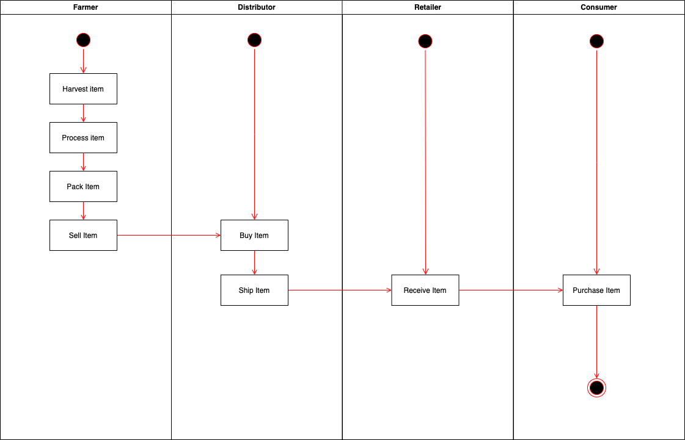
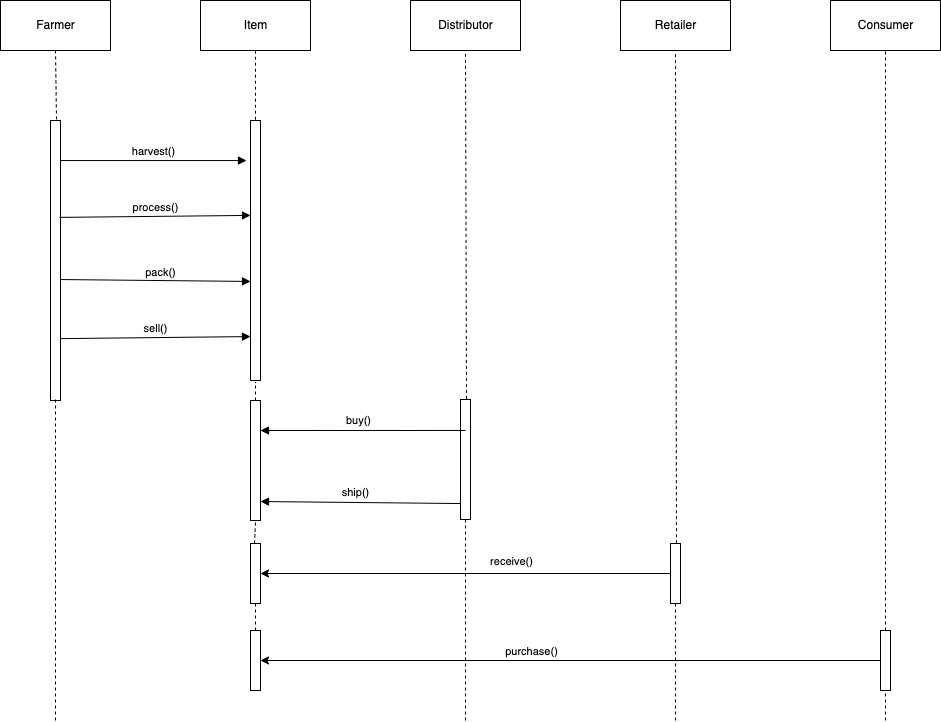
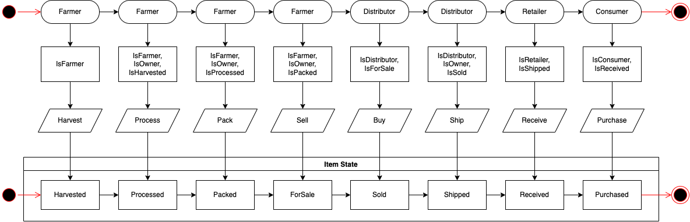
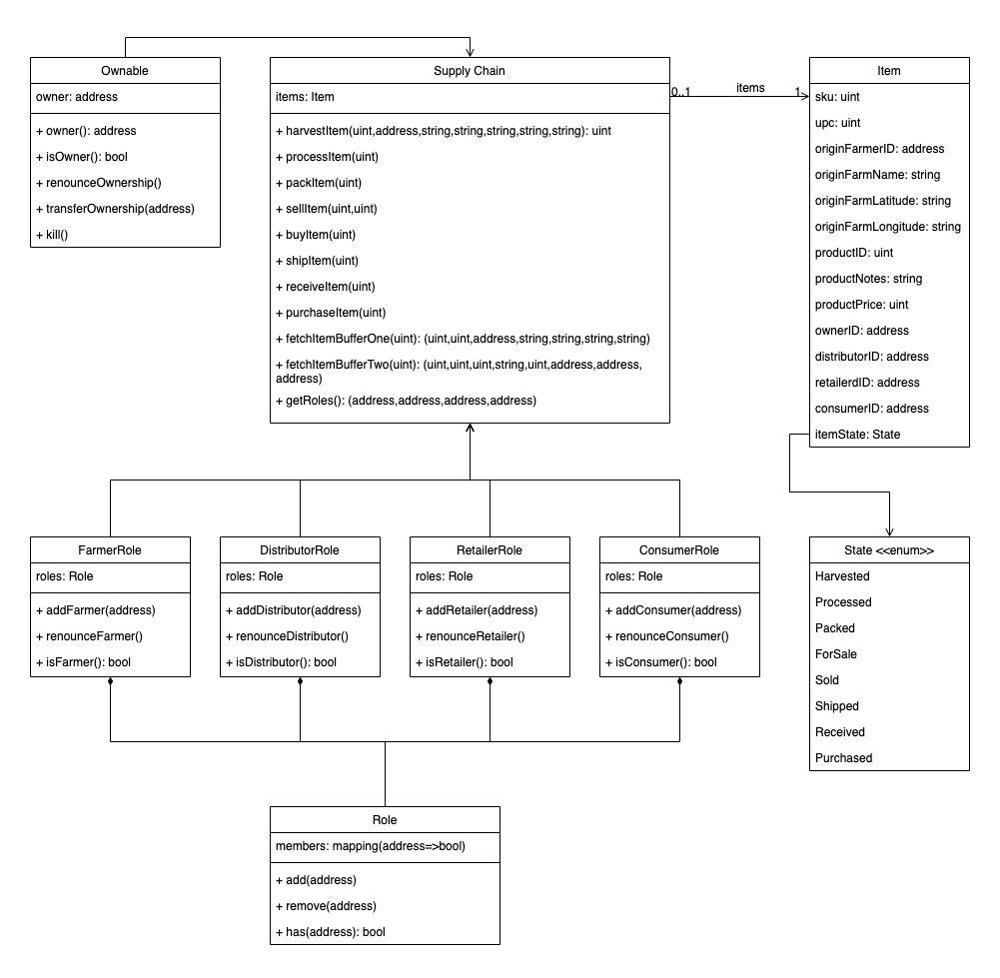

# Supply chain & data auditing

## Deployment
- Contract creation transaction: 0x2a2825e61a25c9361ea69fd79b1db28df3d93e8535cee21ac8b3acb813cab46a https://rinkeby.etherscan.io/tx/0x2a2825e61a25c9361ea69fd79b1db28df3d93e8535cee21ac8b3acb813cab46a
- The contract has been deployed to the rinkeby address 0xB4572600223F91806DA804d01490caF6b78562D3 https://rinkeby.etherscan.io/address/0x702bfcBB7Ea7F99157BDe51d9D5439fEb4168704
- The project has been deployed to IPFS at https://cloudflare-ipfs.com/ipfs/Qma9D52MDU7N2x8hLvvJp6EZgABvon5dj7NUNEZfEK5wip/

## Used Software & Libraries
- Node v16.12.0
- Truffle @5.4.22
- truffle/hdwallet-provider @1.7.0 (for deployment and testing on rinkeby)
- Web3 @1.6.1 (used only in client/browser)

## UML Diagrams

### Activity


### Sequence


### State


### Data Model


## Getting Started

### Installing

A step by step series of examples that tell you have to get a development env running


Change directory to ```project-6``` folder and install all requisite npm packages (as listed in ```package.json```):

```
cd project-6
npm install
```

Launch Ganache:

```
ganache-cli -m "spirit supply whale amount human item harsh scare congress discover talent hamster"
```

Your terminal should look something like this:


In a separate terminal window, Compile smart contracts:

```
truffle compile
```

Your terminal should look something like this:


This will create the smart contract artifacts in folder ```build\contracts```.

Migrate smart contracts to the locally running blockchain, ganache-cli:

```
truffle migrate
```

Your terminal should look something like this:


Test smart contracts:

```
truffle test
```

All 10 tests should pass.


In a separate terminal window, launch the DApp:

```
npm run dev
```

## Built With

* [Ethereum](https://www.ethereum.org/) - Ethereum is a decentralized platform that runs smart contracts
* [IPFS](https://ipfs.io/) - IPFS is the Distributed Web | A peer-to-peer hypermedia protocol
to make the web faster, safer, and more open.
* [Truffle Framework](http://truffleframework.com/) - Truffle is the most popular development framework for Ethereum with a mission to make your life a whole lot easier.

## Acknowledgments

* Solidity
* Ganache-cli
* Truffle
* IPFS
